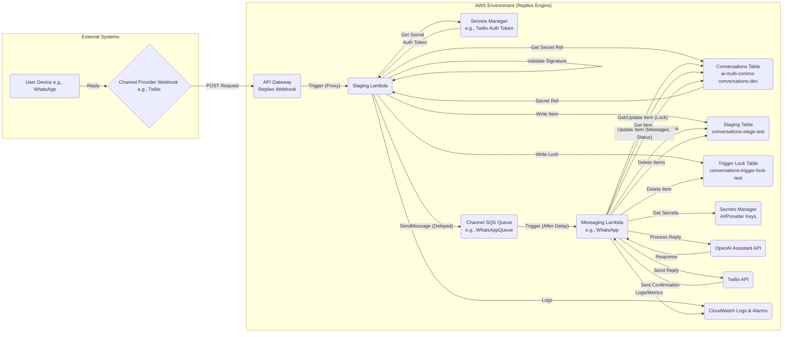

# AI Multi-Comms Engine: Replies Engine - High-Level Design (HLD)

**Version:** 1.0
**Date:** 2025-04-22

## 1. Introduction

### 1.1 Purpose

This document provides the High-Level Design (HLD) for the **Replies Engine**, a core microservice within the AI Multi-Communications Engine.

The primary purpose of the Replies Engine is to handle incoming messages (replies) from end-users across various communication channels (initially WhatsApp, planned SMS/Email) after an initial outbound message has been sent by the **Template Sender Engine**. 

It is responsible for:
*   Receiving notifications of user replies (via webhooks forwarded through a staging process).
*   Batching replies received within a short time window for a single conversation.
*   Retrieving the relevant conversation context and configuration.
*   Processing the user's reply using an appropriate AI assistant (e.g., OpenAI Assistant API).
*   Sending the AI-generated response back to the user via the original communication channel.
*   Maintaining the conversation history and state within a central datastore.
*   Ensuring idempotent processing to prevent duplicate replies.

### 1.2 Scope

This HLD covers the architecture, components, data flow, and key mechanisms of the Replies Engine, specifically focusing on:

*   The Staging Lambda responsible for initial webhook handling, validation, staging, and delayed queuing.
*   The channel-specific Messaging Lambdas responsible for processing queued triggers, AI interaction, and reply sending (starting with WhatsApp).
*   Interaction with supporting AWS services (API Gateway, SQS, DynamoDB, Secrets Manager, CloudWatch).
*   Data models for conversation state and staged messages.
*   Error handling and idempotency strategies.

This document does *not* detail the internal logic of the AI models or the specifics of the upstream Template Sender Engine, except where necessary to understand the interactions.

### 1.3 Goals

*   **Reliable Reply Handling:** Ensure user replies are processed consistently and trigger appropriate AI responses.
*   **Scalability:** Handle varying loads of incoming replies.
*   **Extensibility:** Allow for easy addition of new communication channels (SMS, Email).
*   **Idempotency:** Prevent duplicate processing and replies due to retries or concurrent triggers.
*   **Maintainability:** Clear separation of concerns between staging, messaging, and service interactions.
*   **Security:** Secure handling of credentials and user data.

### 1.4 Definitions and Acronyms

*   **HLD:** High-Level Design
*   **LLD:** Low-Level Design
*   **API:** Application Programming Interface
*   **SQS:** Simple Queue Service (AWS)
*   **DynamoDB:** NoSQL Database Service (AWS)
*   **Lambda:** Serverless Compute Service (AWS)
*   **IAM:** Identity and Access Management (AWS)
*   **OIDC:** OpenID Connect
*   **CI/CD:** Continuous Integration / Continuous Deployment
*   **SAM:** Serverless Application Model (AWS)
*   **ARN:** Amazon Resource Name
*   **TTL:** Time To Live (DynamoDB feature)
*   **GSI:** Global Secondary Index (DynamoDB feature)
*   **Context Object:** Standardized JSON object passed between system components.
*   **Staging Lambda:** The first Lambda in the Replies Engine, handling incoming webhooks.
*   **Messaging Lambda:** The second Lambda, handling channel-specific reply processing.
*   **Template Sender Engine:** The upstream microservice responsible for initiating conversations.

## 2. Architecture Overview

The Replies Engine employs a decoupled, event-driven architecture leveraging serverless AWS components to handle user replies efficiently and reliably. It consists of two main stages orchestrated via SQS:

1.  **Staging Stage:** Handles the initial ingestion and validation of incoming messages from various channels.
2.  **Messaging Stage:** Performs the core processing, AI interaction, and reply dispatch for specific channels.



**Flow Description:**

1.  **Incoming Reply:** The user sends a reply via their device (e.g., WhatsApp).
2.  **Webhook:** The channel provider (e.g., Twilio) sends an HTTP POST request to a configured endpoint on the Replies Engine API Gateway.
3.  **API Gateway:** Authenticates the request (if configured, e.g., via custom authorizer or header validation) and forwards it to the Staging Lambda.
4.  **Staging Lambda:**
    *   Parses the incoming request to extract message details (`Body`, `From`, `To`, `MessageSid`, etc.) and channel type.
    *   Performs an initial lookup (e.g., via GSI on the Conversations Table) using sender/recipient identifiers to retrieve the necessary credential reference (e.g., Twilio Auth Token Secret ARN) and the definitive `conversation_id`.
    *   Fetches the required credential (e.g., Twilio Auth Token) from AWS Secrets Manager.
    *   Validates the webhook signature using the fetched credential.
    *   If valid, writes essential message details (including the `body`) to the `conversations-stage` DynamoDB table (keyed by `conversation_id` and `message_sid`).
    *   Attempts to acquire a trigger lock by performing a conditional `PutItem` into the `conversations-trigger-lock` table (keyed by `conversation_id`, includes TTL).
    *   If the lock is acquired (meaning this is the first message for this conversation within the batch window), it sends a minimal trigger message (`{conversation_id, primary_channel}`) to the appropriate channel-specific SQS queue (`WhatsAppQueue`, `SMSQueue`, etc.) with a configured `DelaySeconds` (e.g., 10 seconds). This delay defines the batching window.
    *   If the lock already exists, it skips sending the SQS message.
    *   Returns an immediate success response (e.g., HTTP 200 OK with empty TwiML for Twilio) to the webhook provider.
5.  **SQS Delay & Trigger:** The SQS message remains invisible for the `DelaySeconds`. Once visible, SQS triggers the corresponding channel-specific Messaging Lambda (e.g., `WhatsAppMessagingLambda`).
6.  **Messaging Lambda:**
    *   Parses the trigger message from SQS to get `conversation_id` and `primary_channel`.
    *   Acquires a processing lock on the main `ConversationsTable` record using a conditional update on `conversation_status`.
    *   Starts an SQS heartbeat to extend message visibility during processing.
    *   Queries the `conversations-stage` table to retrieve all message fragments for the `conversation_id`.
    *   Merges the `body` content from the staged messages.
    *   Fetches the full conversation context (including `ai_config`, `channel_config`, `thread_id`) from the `ConversationsTable`.
    *   Retrieves necessary API keys/credentials (OpenAI, Twilio) from Secrets Manager using references stored in the conversation context.
    *   Interacts with the AI Assistant API (e.g., OpenAI), providing the existing `thread_id` and the merged user message content.
    *   Parses the AI's response (handling expected JSON structure).
    *   Sends the formatted AI reply back to the user via the channel provider's API (e.g., Twilio WhatsApp API).
    *   Performs a final atomic update on the `ConversationsTable` to append the user message (merged) and the assistant message (sent) to the `messages` list, update token counts, timestamps, and set the `conversation_status` (releasing the lock).
    *   Cleans up by deleting the processed items from the `conversations-stage` table and the entry from the `conversations-trigger-lock` table.
    *   Stops the SQS heartbeat.
7.  **CloudWatch:** Both Lambda functions send logs and potentially metrics to CloudWatch for monitoring and alerting.

This architecture decouples message ingestion/validation from the potentially long-running AI processing and reply sending, enables short-term message batching, and provides resilience through SQS queues and idempotency mechanisms.

## 3. Key Components

This section details the main components of the Replies Engine architecture.

### 3.1 API Gateway (e.g., `ai-multi-comms-replies-webhook-dev`)

*   **Purpose:** Provides a secure, public HTTP endpoint for receiving incoming webhook requests from channel providers (e.g., Twilio).
*   **Responsibilities:**
    *   Receives POST requests on channel-specific paths (e.g., `/whatsapp`, `/sms`).
    *   Performs initial request authentication/authorization (e.g., API Key validation via Usage Plan).
    *   Uses `AWS_PROXY` integration to forward the entire request context (headers, body, path, etc.) to the Staging Lambda.
    *   Returns the HTTP response generated by the Staging Lambda back to the channel provider.

### 3.2 Staging Lambda (e.g., `RepliesStagingLambda-dev`)

*   **Purpose:** Acts as the initial processing point for all incoming replies, handling validation, staging, and trigger queuing.
*   **Trigger:** API Gateway.
*   **Responsibilities:**
    *   Parses the incoming provider-specific webhook payload.
    *   Extracts essential identifiers (`From`, `To`, `MessageSid`, `Body`, channel type).
    *   Looks up conversation context (`conversation_id`, `credential_ref`) from the `ConversationsTable` using a GSI.
    *   Fetches the necessary authentication token (e.g., Twilio Auth Token) from Secrets Manager.
    *   Validates the webhook signature (crucial security step).
    *   If valid, writes message fragments (including `body`) to the `ConversationsStageTable`.
    *   Attempts to acquire a lock in the `ConversationsTriggerLockTable`.
    *   If lock acquired, sends a trigger message (containing `conversation_id` and `primary_channel`) with a delay to the appropriate SQS Channel Queue.
    *   Returns an immediate success/acknowledgment response to API Gateway (e.g., empty TwiML).
    *   Handles errors gracefully, returning appropriate HTTP status codes or triggering specific responses (like TwiML) for certain channel providers.

### 3.3 SQS Channel Queues (e.g., `ai-multi-comms-replies-whatsapp-queue-dev`)

*   **Purpose:** Decouple the Staging Lambda from the Messaging Lambda, providing resilience and enabling delayed processing for batching.
*   **Type:** Standard Queues.
*   **Configuration:** Configured with a `DelaySeconds` equivalent to the desired batching window (`W`).
*   **Trigger:** Receives trigger messages from the Staging Lambda.
*   **Consumer:** Triggers the corresponding channel-specific Messaging Lambda.
*   **DLQ:** Each queue should have an associated Dead Letter Queue configured to capture messages that fail processing repeatedly. 

### 3.4 Messaging Lambda (e.g., `RepliesWhatsAppMessagingLambda-dev`)

*   **Purpose:** Performs the main reply processing logic for a specific channel.
*   **Trigger:** Corresponding SQS Channel Queue.
*   **Responsibilities:**
    *   Parses the trigger message (`conversation_id`, `primary_channel`).
    *   Acquires a processing lock on the `ConversationsTable` item.
    *   Extends SQS message visibility using a heartbeat mechanism.
    *   Retrieves all relevant staged message fragments from `ConversationsStageTable` for the `conversation_id`.
    *   Merges message fragments into a single `combined_body`.
    *   Hydrates the full conversation context (including `ai_config`, `channel_config`, `thread_id`) from the `ConversationsTable`.
    *   Fetches channel provider (e.g., Twilio) and AI provider (e.g., OpenAI) credentials from Secrets Manager.
    *   Calls the configured AI Assistant API with the conversation history (`thread_id`) and the new user message (`combined_body`).
    *   Parses the AI response.
    *   Sends the formatted reply to the user via the channel provider API.
    *   Atomically updates the `ConversationsTable` record: appends user and assistant messages to the history, updates status, token counts, timestamps.
    *   Cleans up processed records from `ConversationsStageTable` and `ConversationsTriggerLockTable`.
    *   Handles transient vs. permanent errors appropriately (retry via SQS exception vs. DLQ/log).

### 3.5 DynamoDB Tables

*   **`ConversationsTable` (e.g., `ai-multi-comms-conversations-dev`):**
    *   Purpose: Stores the canonical state and history of each conversation.
    *   Key Schema: `primary_channel` (PK), `conversation_id` (SK).
    *   Accessed by: Staging Lambda (GSI query, GetItem after validation), Messaging Lambda (GetItem, UpdateItem for locking and final state update).
    *   Contains: Conversation history (`messages` list), status, AI/channel config (channel-specific), `thread_id`, timestamps, etc.
*   **`ConversationsStageTable` (e.g., `conversations-stage-test/dev/prod`):**
    *   Purpose: Temporarily stores incoming message fragments during the batching window.
    *   Key Schema: `conversation_id` (PK), `message_sid` (SK).
    *   TTL: Enabled on `expires_at` attribute for automatic cleanup.
    *   Accessed by: Staging Lambda (Write), Messaging Lambda (Query, Batch Delete).
*   **`ConversationsTriggerLockTable` (e.g., `conversations-trigger-lock-test/dev/prod`):**
    *   Purpose: Prevents multiple SQS trigger messages being sent for the same conversation batch.
    *   Key Schema: `conversation_id` (PK).
    *   TTL: Enabled on `expires_at` attribute for automatic cleanup.
    *   Accessed by: Staging Lambda (Conditional Write), Messaging Lambda (Delete).

### 3.6 AWS Secrets Manager

*   **Purpose:** Securely stores sensitive credentials (Twilio Auth Tokens, API Keys; OpenAI API Keys).
*   **Access:** Read-only access (`secretsmanager:GetSecretValue`) granted to Lambdas via IAM roles.
*   **Structure:** Secrets typically stored as JSON key-value pairs.
*   **Naming Convention:** Uses a structured path incorporating project prefix, credential type, company/project (or wildcards), provider, and environment (e.g., `ai-multi-comms/whatsapp-credentials/*/*/twilio-dev-*`).

### 3.7 External Services

*   **Channel Providers (e.g., Twilio):** Receive incoming messages via webhooks, send outgoing replies via API.
*   **AI Provider (e.g., OpenAI):** Provides the Assistant API for generating conversational responses.

### 3.8 CloudWatch

*   **Purpose:** Centralized logging, monitoring, and alerting.
*   **Usage:** Both Lambdas send logs. Alarms can be configured based on logs (e.g., CRITICAL errors) or standard Lambda metrics (Errors, Throttles, Duration).

## 4. Data Flow and Interaction Diagrams

### 4.1 Detailed Reply Processing Sequence

This diagram illustrates the detailed flow of processing a user's reply, focusing on the interactions within the Replies Engine.

```mermaid
sequenceDiagram
    participant ProviderWebhook as Channel Provider Webhook
    participant APIGW as API Gateway
    participant StagingLambda as Staging Lambda
    participant SecretsMgr as Secrets Manager
    participant DynamoDBConv as Conversations Table
    participant DynamoDBStage as Staging Table
    participant DynamoDBLock as Trigger Lock Table
    participant SQSQueue as Channel Queue (Delayed)
    participant MessagingLambda as Messaging Lambda
    participant OpenAI as OpenAI Assistant API
    participant ChannelProviderAPI as Channel Provider API
    participant UserDevice

    Note over ProviderWebhook, UserDevice: User sends reply
    ProviderWebhook->>+APIGW: POST /whatsapp {Body, From, To, ...}
    APIGW-->>StagingLambda: Trigger (Proxy Event)

    StagingLambda->>StagingLambda: Parse Request
    StagingLambda->>+DynamoDBConv: Query GSI (using To, From)
    DynamoDBConv-->>-StagingLambda: Return {channel_config, conversation_id}
    StagingLambda->>+SecretsMgr: GetSecretValue(channel_config.whatsapp_credentials_id)
    SecretsMgr-->>-StagingLambda: Return Auth Token
    StagingLambda->>StagingLambda: Validate Signature(Event, AuthToken)
    alt Signature Valid
        StagingLambda->>+DynamoDBStage: PutItem({conv_id, msg_sid, body, primary_channel, expires_at, ...})
        DynamoDBStage-->>-StagingLambda: OK
        StagingLambda->>+DynamoDBLock: PutItem({conv_id, expires_at}) Condition: attr_not_exists(conversation_id)
        alt Lock Acquired (First message in window)
            DynamoDBLock-->>-StagingLambda: OK
            StagingLambda->>+SQSQueue: SendMessage({conv_id, primary_channel}, DelaySeconds=W)
            SQSQueue-->>-StagingLambda: OK
        else Lock Exists
            DynamoDBLock-->>-StagingLambda: ConditionalCheckFailedException
            StagingLambda->>StagingLambda: Log "Lock exists, skipping SQS"
        end
        StagingLambda-->>-APIGW: Return 200 OK (e.g., empty TwiML)
    else Signature Invalid
        StagingLambda-->>-APIGW: Return Error Response (e.g., 200 OK empty TwiML)
    end
    APIGW-->>-ProviderWebhook: Forward Response

    Note over SQSQueue, MessagingLambda: Wait for SQS Delay (W seconds)
    SQSQueue-->>+MessagingLambda: Trigger (Message: {conv_id, primary_channel})
    MessagingLambda->>MessagingLambda: Parse Trigger Message
    MessagingLambda->>+DynamoDBConv: UpdateItem (SET status=processing_reply) Condition: status<>processing_reply
    alt Lock Acquired
        DynamoDBConv-->>-MessagingLambda: OK
        MessagingLambda->>MessagingLambda: Start SQS Heartbeat
        MessagingLambda->>+DynamoDBStage: Query(conversation_id)
        DynamoDBStage-->>-MessagingLambda: Return Staged Items [{body,...},...]
        MessagingLambda->>MessagingLambda: Merge item bodies -> combined_body
        MessagingLambda->>+DynamoDBConv: GetItem(primary_channel, conversation_id)
        DynamoDBConv-->>-MessagingLambda: Return Full Conversation Record
        MessagingLambda->>+SecretsMgr: GetSecretValue(ai_config.api_key_reference)
        SecretsMgr-->>-MessagingLambda: OpenAI API Key
        MessagingLambda->>+SecretsMgr: GetSecretValue(channel_config.whatsapp_credentials_id)
        SecretsMgr-->>-MessagingLambda: Twilio Credentials
        MessagingLambda->>+OpenAI: Add Message(thread_id, combined_body)
        OpenAI-->>-MessagingLambda: Message Added
        MessagingLambda->>+OpenAI: Create Run(thread_id, assistant_id)
        OpenAI-->>-MessagingLambda: Run Created (run_id)
        loop Poll Run Status
            MessagingLambda->>+OpenAI: Retrieve Run(thread_id, run_id)
            OpenAI-->>-MessagingLambda: Run Status (e.g., 'in_progress')
            alt Run Completed
                 MessagingLambda->>+OpenAI: List Messages(thread_id, order=desc)
                 OpenAI-->>-MessagingLambda: Messages List
                 MessagingLambda->>MessagingLambda: Extract Assistant Reply Content
                 break
            else Run Failed/Expired
                 MessagingLambda->>MessagingLambda: Log Error, Prepare Failure
                 break
            end
        end
        MessagingLambda->>MessagingLambda: Parse JSON from AI response
        MessagingLambda->>+ChannelProviderAPI: Send Reply(To=primary_channel, Body=Extracted Content)
        ChannelProviderAPI-->>-MessagingLambda: Message SID
        MessagingLambda->>+DynamoDBConv: UpdateItem (Append User Msg, Append Assistant Msg, SET status=reply_sent, ...)
        DynamoDBConv-->>-MessagingLambda: OK
        MessagingLambda->>+DynamoDBStage: BatchWriteItem(Delete Staged Items)
        DynamoDBStage-->>-MessagingLambda: OK
        MessagingLambda->>+DynamoDBLock: DeleteItem(conversation_id)
        DynamoDBLock-->>-MessagingLambda: OK
        MessagingLambda->>MessagingLambda: Stop SQS Heartbeat
        Note over MessagingLambda, SQSQueue: Implicit SQS Message Delete on Success
    else Lock Already Held (Concurrent Run)
        DynamoDBConv-->>-MessagingLambda: ConditionalCheckFailedException
        MessagingLambda->>MessagingLambda: Log Warning, Finish (Implicit SQS Delete)
    end
```

## 5. Data Models

The Replies Engine relies on three primary DynamoDB tables.

### 5.1 Conversations Table (e.g., `ai-multi-comms-conversations-dev`)

*   **Purpose:** Stores the canonical, long-term state and history of each conversation.
*   **Key Schema:**
    *   `primary_channel` (String, PK): User identifier (e.g., phone number without prefix, email address).
    *   `conversation_id` (String, SK): Unique identifier for the conversation session (often includes company/project/request IDs and user ID).
*   **Key Attributes:**
    *   `messages` (List of Maps): Chronological list of user and assistant messages (see LLD for map structure).
    *   `conversation_status` (String): Tracks the current state (e.g., `template_sent`, `processing_reply`, `reply_sent`, `retry`, `handoff_required`). Used for locking.
    *   `channel_config` (Map): Channel-specific configuration extracted from Company Data (e.g., `{ "company_whatsapp_number": "...", "whatsapp_credentials_id": "..." }`). **Note:** This map is *not* nested by channel within the conversation record.
    *   `ai_config` (Map): AI-specific configuration extracted from Company Data (e.g., `{ "api_key_reference": "...", "assistant_id_replies": "..." }`). **Note:** This map is *not* nested by channel within the conversation record.
    *   `thread_id` (String): The identifier for the corresponding OpenAI Assistant thread.
    *   `updated_at` (String): ISO 8601 timestamp of the last update.
    *   `created_at` (String): ISO 8601 timestamp of creation.
    *   `hand_off_to_human` (Boolean): Flag indicating if manual intervention is needed.
    *   `task_complete` (Number): Flag indicating if the AI considers its task finished.
    *   (GSIs as needed for lookups, e.g., by company number + user number).
*   **Access:** Read/Write by Staging and Messaging Lambdas.

### 5.2 Staging Table (e.g., `conversations-stage-test`)

*   **Purpose:** Temporarily stores individual incoming message fragments during the batching window.
*   **Key Schema:**
    *   `conversation_id` (String, PK): Links fragments to a conversation.
    *   `message_sid` (String, SK): Unique identifier for the message fragment (e.g., Twilio SID).
*   **Key Attributes:**
    *   `body` (String): The content of the message fragment.
    *   `primary_channel` (String): User identifier (e.g., phone number).
    *   `received_at` (String): ISO 8601 timestamp when the message was received by Staging Lambda.
    *   `expires_at` (Number): TTL attribute (Unix timestamp) for automatic cleanup.
*   **Access:** Write by Staging Lambda, Read/Delete by Messaging Lambda.

### 5.3 Trigger Lock Table (e.g., `conversations-trigger-lock-test`)

*   **Purpose:** Ensures only one SQS trigger message is sent per conversation batch window.
*   **Key Schema:**
    *   `conversation_id` (String, PK): The conversation identifier.
*   **Key Attributes:**
    *   `expires_at` (Number): TTL attribute (Unix timestamp) for automatic cleanup, set based on batch window + buffer.
*   **Access:** Conditional Write by Staging Lambda, Delete by Messaging Lambda.

## 6. Key Mechanisms

Several key mechanisms enable the reliable and robust operation of the Replies Engine.

### 6.1 Message Batching & Delayed Processing

*   **Purpose:** To handle potential rapid-fire replies from a user as a single conversational turn for the AI, reducing unnecessary processing and potential race conditions.
*   **Mechanism:**
    1.  **Trigger Lock:** When the first message fragment for a conversation arrives at the `StagingLambda` within a potential batch window, it attempts to acquire a lock by writing an item to the `ConversationsTriggerLockTable` with the `conversation_id` as the key and a ConditionExpression `attribute_not_exists(conversation_id)`.
    2.  **Delayed SQS Message:** If the lock is successfully acquired, the `StagingLambda` sends a *single* trigger message (containing `conversation_id` and `primary_channel`) to the appropriate channel SQS queue (e.g., `WhatsAppQueue`) with `DelaySeconds` set to the configured batch window `W` (e.g., 10 seconds).
    3.  **Subsequent Messages:** If subsequent message fragments for the *same* conversation arrive at the `StagingLambda` *before* the lock expires (or is deleted), the lock acquisition attempt will fail (`ConditionalCheckFailedException`). The `StagingLambda` simply writes the fragment to the `ConversationsStageTable` and does *not* send another SQS message.
    4.  **Processing Trigger:** After `W` seconds, the single SQS trigger message becomes visible, invoking the `MessagingLambda`.
    5.  **Consuming the Batch:** The `MessagingLambda` queries the `ConversationsStageTable` for *all* items matching the `conversation_id` received from the SQS message, effectively retrieving all fragments collected during the window `W`.
*   **Benefits:** Groups related message parts, simplifies AI interaction logic.
*   **Considerations:** The batch window `W` needs to be balanced between responsiveness and capturing related messages.

### 6.2 Idempotent Processing Lock

*   **Purpose:** To prevent multiple `MessagingLambda` invocations (e.g., due to SQS retries or concurrent deliveries) from processing the same conversation batch simultaneously, which could lead to duplicate AI calls and replies.
*   **Mechanism:**
    1.  **Acquisition:** At the start of its execution, the `MessagingLambda` attempts to acquire a lock by performing a conditional `UpdateItem` on the main `ConversationsTable` record for the specific `conversation_id`.
    2.  **Condition:** The update (`SET conversation_status = 'processing_reply'`) only succeeds if the current `conversation_status` is *not* already `'processing_reply'` (`attribute_not_exists(conversation_status) OR conversation_status <> :processing_reply`).
    3.  **Outcome:**
        *   If the update succeeds, the Lambda proceeds with processing.
        *   If the update fails with `ConditionalCheckFailedException`, it means another instance is already processing this conversation (or it failed previously without releasing the lock). The Lambda logs a warning and exits gracefully (allowing the SQS message to be deleted without processing).
    4.  **Release:** The lock is implicitly released when the final `UpdateItem` (Step 12 in the flow) successfully changes the `conversation_status` to a non-processing state (e.g., `'reply_sent'`). An explicit release (setting status to `'retry'` or similar) is performed in the `finally` block if an error occurs *after* lock acquisition but *before* the final successful update.
*   **Benefits:** Ensures each batch trigger results in at most one end-to-end processing run.

### 6.3 SQS Heartbeat (Visibility Timeout Extension)

*   **Purpose:** To prevent SQS from making a message visible again for redelivery while the `MessagingLambda` is performing potentially long-running tasks (like waiting for the OpenAI API).
*   **Mechanism:**
    1.  **Start:** After successfully acquiring the processing lock, the `MessagingLambda` starts a background thread (`SQSHeartbeat` utility).
    2.  **Extend Visibility:** This thread periodically calls the SQS `ChangeMessageVisibility` API, resetting the message's visibility timeout using the `receiptHandle` obtained from the initial SQS event.
    3.  **Interval:** The extension interval is significantly shorter than the visibility timeout itself (e.g., extend by 10 minutes every 5 minutes).
    4.  **Stop:** The heartbeat thread is explicitly stopped in the Lambda's `finally` block (on success or failure) to cease visibility extensions.
*   **Benefits:** Allows the Lambda function execution time to safely exceed the SQS queue's default visibility timeout without causing duplicate message processing.
*   **Considerations:** Requires the Lambda's IAM role to have `sqs:ChangeMessageVisibility` permission on the trigger queue.

## 7. Deployment Strategy

*   **Initial Testing (`-test`):** Manual deployment using AWS CLI for individual components (IAM Roles/Policies, Lambda Functions, SQS Mappings) was performed for initial integration and debugging.
*   **Development (`dev`) / Production (`prod`):** The target deployment strategy utilizes AWS SAM (`template.yaml`) to define all necessary resources (Lambdas, Roles, Policies, SQS Queues, DynamoDB Tables with TTL, API Gateway, Event Source Mappings) in a parameterized way.
*   **CI/CD:** Deployment to `dev` and `prod` environments will be automated via GitHub Actions workflows triggered by pushes to the `develop` and `main` branches respectively, using OIDC for secure AWS authentication.

## 8. Non-Functional Requirements

*   **Scalability:** The serverless architecture (Lambda, SQS, DynamoDB) is designed to scale automatically based on incoming message volume.
*   **Reliability:** SQS queues provide decoupling and retry mechanisms. DLQs capture messages failing persistent processing. Idempotency locks prevent duplicate processing. TTL on staging/lock tables ensures eventual cleanup.
*   **Security:** IAM roles follow least privilege. Sensitive credentials stored in AWS Secrets Manager. API Gateway handles initial authentication. Webhook signature validation performed by Staging Lambda.
*   **Extensibility:** Designed with channel-specific Messaging Lambdas and SQS queues to facilitate adding support for new channels (SMS, Email) with minimal impact on existing flows.
*   **Maintainability:** Code is modularized into services (DB, SQS, Secrets), core logic (validation, routing), and utilities (parsing, response building). Centralized logging via CloudWatch. 