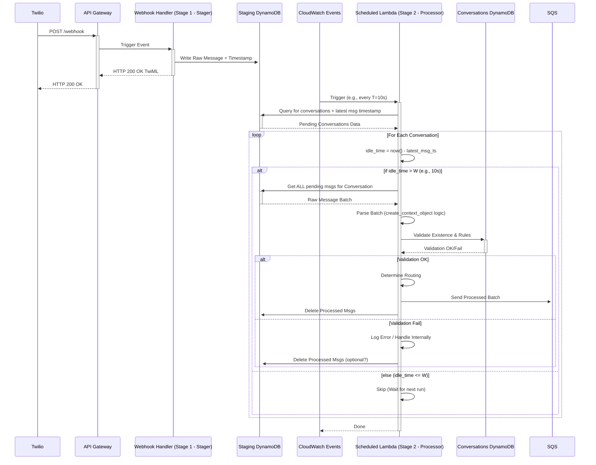

# Batching Pattern: DynamoDB Staging + Scheduled Lambda

## 1. Problem Statement

Standard SQS `DelaySeconds` applies per-message delays independently. This prevents guaranteeing that all messages arriving from a user within a specific time window (e.g., 10 seconds of each other) are processed together as a single batch before potentially triggering downstream actions like AI interaction. We need a mechanism to reliably collect all parts of a potentially multi-message reply within a defined window before processing begins.

## 2. Goal

- Implement a consistent batching window (e.g., **W = 10 seconds**).
- Processing for a conversation should only begin once **W** seconds have passed since the *last* message for that specific conversation arrived.
- All messages received within that window should be processed together as a single batch.
- Keep the latency before processing starts reasonably low and predictable (target ~10-20 seconds after the user finishes sending).

## 3. Proposed Architecture

This pattern shifts the primary processing logic from the Lambda directly triggered by API Gateway to a Lambda triggered on a schedule.

### 3.1 Components

1.  **API Gateway:** Receives the initial webhook request (as currently configured).
2.  **Stager Lambda (NEW):**
    *   Triggered directly by API Gateway (`AWS_PROXY`).
    *   **Responsibility:** Extremely simple and fast.
    *   Receives the raw `event`.
    *   Extracts minimal identifiers (e.g., raw sender/recipient IDs).
    *   Writes the raw message body (or essential parts) and an arrival timestamp to the Staging DynamoDB Table, keyed by a conversation identifier.
    *   Immediately returns `200 OK` (e.g., empty TwiML for Twilio) to acknowledge receipt.
3.  **Staging DynamoDB Table (NEW):**
    *   A separate table designed for temporary storage of *pending* raw messages.
    *   Schema likely includes: `conversation_id` (PK), `arrival_timestamp` (SK or attribute), `raw_message_data`.
4.  **CloudWatch Events / EventBridge Scheduler:**
    *   Triggers the Processor Lambda on a fixed schedule (e.g., every **T = 10 seconds**).
5.  **Processor Lambda (Scheduled - NEW Logic Location):**
    *   **Responsibility:** Performs the main processing logic previously designed for the `webhook_handler`.
    *   Triggered by the Scheduler, *not* API Gateway.
    *   **Logic:**
        *   Queries the Staging Table to find unique `conversation_id`s with pending messages.
        *   For each `conversation_id`:
            *   Finds the timestamp of the *most recent* pending message (`latest_message_ts`).
            *   Calculates `idle_time = currentTime - latest_message_ts`.
            *   If `idle_time > W` (e.g., > 10 seconds):
                *   Gathers *all* pending messages for this `conversation_id` from the Staging Table.
                *   **Parses** the raw messages (e.g., using logic similar to `create_context_object`).
                *   **Validates** against the main `ConversationsTable` (e.g., using `check_conversation_exists`, `validate_conversation_rules`). Handles validation errors internally (logging, potentially updating main table status).
                *   **Determines Routing** (e.g., using `determine_target_queue`).
                *   **Sends** the *entire processed batch* (as a single message or appropriately formatted structure) to the target SQS Queue (Handoff, WhatsApp, SMS, Email).
                *   **Deletes** the processed messages from the Staging Table.
            *   If `idle_time <= W`, does nothing for this conversation (it's still in the active window).
6.  **Conversations DynamoDB Table:** Used by the Processor Lambda for validation lookups.
7.  **SQS Queues (WhatsApp, SMS, Email, Handoff):** Receive the *processed batches* from the Processor Lambda. These queues likely do *not* need `DelaySeconds` configured anymore, as the batching window is handled before messages arrive here.

### 3.2 Flow Diagram

## 4. Benefits

*   **Guaranteed Batching Window:** Reliably groups messages arriving within **W** seconds of the *last* message for a conversation.
*   **Consistent Latency Ceiling:** Maximum time from the user finishing sending to processing starting is predictable (approx. W + T). With W=10s, T=10s, this is ~10-20s.
*   **Predictable Invocation Costs:** The Processor Lambda runs on a fixed schedule, making invocation costs independent of traffic spikes (though compute duration still varies).
*   **Simple Stager Lambda:** The function directly handling webhooks is very fast and simple, reducing the chance of timeouts impacting the webhook provider.

## 5. Trade-offs & Considerations

*   **Increased Complexity:** Requires an extra DynamoDB table (Staging Table) and a scheduled Lambda function.
*   **Latency:** Introduces a minimum processing delay of **W** seconds plus potential scheduling latency up to **T** seconds.
*   **Immediate ACK:** The initial `200 OK` only confirms receipt into staging, not successful validation/processing. Failures found later by the Processor Lambda must be handled internally.
*   **Staging Table Cleanup:** Requires robust logic in the Processor Lambda to delete messages after successful processing (or potentially after failed validation if desired) to prevent reprocessing. Consider DynamoDB TTL on the staging table as a backup cleanup mechanism.
*   **Concurrency:** The Processor Lambda needs to handle potential concurrent runs gracefully if its execution time exceeds the schedule interval **T** (though less likely with a simple polling/processing loop). The DynamoDB lock (`conversation_status`) is still relevant *during* the processing part within the Processor Lambda if interacting with the main `ConversationsTable`. 