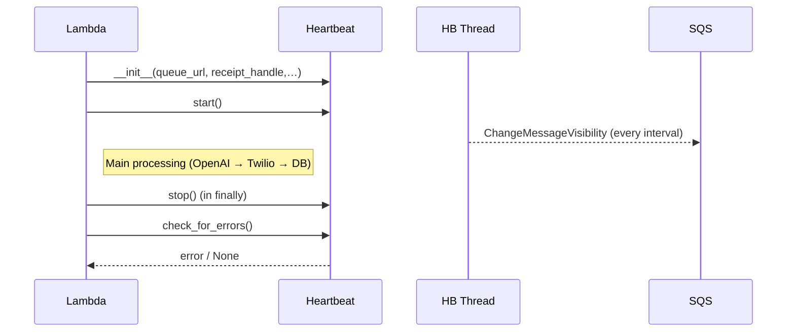

# SQS Heartbeat Utility – Low‑Level Design (Replies‑Engine)

## 1  Purpose

`SQSHeartbeat` prevents a long‑running **Messaging Lambda** (Stage‑2) from losing ownership of the SQS trigger message while it is calling OpenAI, Twilio, or performing heavy DynamoDB work.
It does so by periodically invoking `ChangeMessageVisibility` for the message's `receiptHandle` in a background (daemon) thread.

## 2  Context of Use

| Producer | Consumer | Queue | Why Heartbeat? |
| -------- | -------- | ----- | -------------- |
| Staging Lambda (Stage‑1) | Messaging Lambda (Stage‑2) | Channel queues (`…‑whatsapp‑queue‑<env>`, etc.) | Stage‑2 processing can take **≥ 5 min**; queue `VisibilityTimeout` is ~15 min. |

## 3  Key Requirements

1. **Extend visibility** every `interval_sec` (< VisibilityTimeout).
2. **Non‑blocking** – must not slow down the main handler.
3. **Graceful stop** in both success and error paths.
4. **Error surfacing** – if the heartbeat fails, the handler must see the exception and treat the message as failed (so it will be retried).
5. **Daemon thread** – ensures Lambda shutdown isn't blocked.

IAM permission required for the Lambda execution role:

```yaml
Action: sqs:ChangeMessageVisibility
Resource:
  - arn:aws:sqs:${AWS::Region}:${AWS::AccountId}:${ProjectPrefix}-whatsapp-queue-*
  - arn:aws:sqs:${AWS::Region}:${AWS::AccountId}:${ProjectPrefix}-sms-queue-*
  - arn:aws:sqs:${AWS::Region}:${AWS::AccountId}:${ProjectPrefix}-email-queue-*
```

## 4  Class Overview (`SQSHeartbeat`)

| Method | Responsibility |
| ------ | -------------- |
| `__init__(queue_url, receipt_handle, interval_sec, visibility_timeout_sec=600)` | Validate args; create boto3 SQS client; prime internal state. |
| `_run()` | Background loop: `wait(interval_sec)` → `change_message_visibility` → log / capture errors. |
| `start()` | Launch daemon thread; set `_running = True`. |
| `stop()` | Signal thread via `_stop_event`; join with timeout; reset state. |
| `check_for_errors()` | Return first captured `Exception` or `None`. |
| `running` (property) | Thread‑safe indicator of active heartbeat. |

See the Template‑Sender Engine implementation (`template-sender-engine/src_dev/channel_processor/whatsapp/app/lambda_pkg/utils/sqs_heartbeat.py`) – the Replies‑Engine copy is identical except for module path.

## 5  Configuration

| Env  Var | Default | Effect |
| ------- | ------- | ------ |
| `SQS_HEARTBEAT_INTERVAL_MS` | `300000` (5 min) | Converted to seconds for `interval_sec`. Must be << queue `VisibilityTimeout` (905 s). |

`visibility_timeout_sec` keeps the default (600 s); can be overridden later if we raise the queue visibility.

## 6  Integration in Messaging Lambda



If `check_for_errors()` returns non‑`None`, the handler raises it so SQS will retry.

## 7  Monitoring

* **Metric**: `HeartbeatFailures` (increment when `check_for_errors()` returns an error).
* **Alarm**: `>= 1` failure within 5 min → SNS `critical‑alerts-<env>`.

## 8  Edge Cases

| Case | Handling |
| ---- | -------- |
| Heartbeat thread crashes | Error stored → surfaced via `check_for_errors()` → batch item marked failed. |
| Lambda finishes early | `stop()` is still called; zero or one extra API call. |
| Missing `receiptHandle` | Heartbeat skipped; log WARN. | 