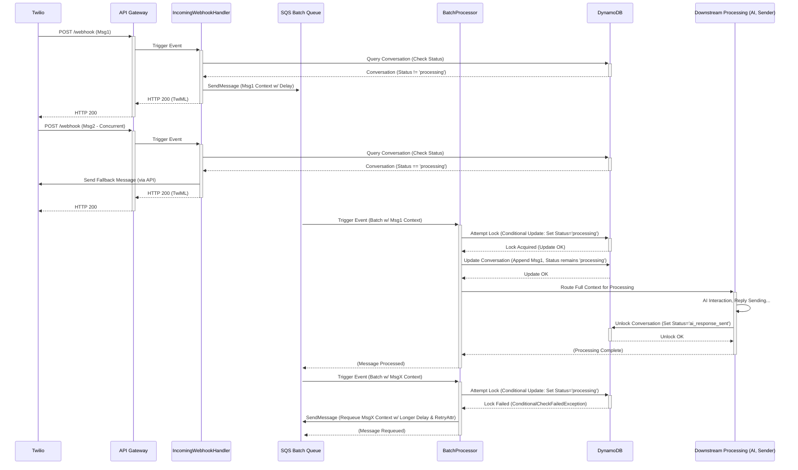

# IncomingWebhookHandler Lambda - Low-Level Design v2

This document describes the low-level design for the webhook processing system, encompassing the initial `IncomingWebhookHandler` Lambda (Stage 1) and the subsequent `BatchProcessorLambda` (Stage 2). It details the architecture for handling incoming webhooks across multiple channels with a primary focus on enhanced concurrency control mechanisms.

## 1. Purpose and Responsibilities

The system employs a two-stage architecture to handle incoming messages efficiently and reliably:

1.  **IncomingWebhookHandler Lambda (Stage 1):** This function acts as the central, unified entry point for all webhook requests.
    *   **Receives:** Accepts webhook POST requests from various communication channels (initially WhatsApp/SMS via Twilio) forwarded by API Gateway.
    *   **Validates:** Performs initial validation including authenticity checks (e.g., Twilio signature verification) and preliminary business logic checks against the conversation record.
    *   **Routes:** Determines the appropriate next step based on validation and conversation state, queueing the message context to either an AI processing queue or a human handoff queue.
    *   **Acknowledges:** Returns an immediate success response (e.g., HTTP 200 with TwiML) to the webhook provider (like Twilio) to confirm receipt, without waiting for downstream processing.

2.  **BatchProcessor Lambda (Stage 2):** This function processes messages after a delay, handling batching and critical state management.
    *   **Receives:** Triggered by SQS messages from the batch queue after the configured delay.
    *   **Groups:** Aggregates messages received within the batch window for the same conversation.
    *   **Locks:** Implements a locking mechanism to ensure only one instance processes messages for a specific conversation at a time.
    *   **Updates:** Persists the batched user messages to the conversation record in DynamoDB.
    *   **Prepares:** Creates a comprehensive context object for further processing (e.g., AI interaction).
    *   **Routes:** Sends the context object to the next stage (e.g., AI processing queue).

## 2. Concurrency Control Design

### 2.1 Key Concurrency Challenges Addressed

This design directly addresses critical concurrency scenarios:

*   **Simultaneous Messages:** Handling multiple messages from the same sender arriving very close together.
*   **Message Processing Overlap:** A new message arriving for a conversation while a previous message (or batch) for that *same conversation* is still undergoing processing (e.g., waiting for an AI response).

### 2.2 Concurrency Control Strategy

The strategy combines two key mechanisms:

1.  **Message Batching via SQS Delay:**
    *   Incoming messages destined for AI processing are placed onto an SQS queue configured with a `DelaySeconds` parameter (recommended: 10-20 seconds).
    *   This delay creates a "batching window," allowing messages sent in quick succession by a user to be grouped together before processing begins.

2.  **Conversation Locking via Status Flag:**
    *   Before the `BatchProcessorLambda` starts processing a batch of messages for a conversation, it attempts to "lock" the corresponding conversation record in DynamoDB.
    *   This lock is achieved by using a conditional `UpdateItem` operation to set the `conversation_status` field to `processing_reply`.
    *   The condition ensures the update only succeeds if the status is *not already* `processing_reply`.
    *   If the lock attempt fails, it means another process holds the lock, and the current batch is requeued.
    *   The lock is released (status updated, e.g., to `ai_response_sent`) only after the entire processing cycle for that batch, including sending the reply, is complete.

## 3. Detailed Processing Flow

### 3.1 Stage 1: IncomingWebhookHandler Lambda

1.  **Reception & Parsing:**
    *   API Gateway triggers the Lambda upon receiving a webhook.
    *   The channel (WhatsApp, SMS, etc.) is identified from the request path.
    *   A channel-specific parser validates the webhook's authenticity (e.g., signature check) and extracts key data (sender ID, message content, timestamp, etc.).

2.  **Conversation Validation:**
    *   The core validation logic queries the `ConversationsTable` using the sender ID.
    *   **Checks Performed:**
        *   Does a conversation record exist?
        *   Is the associated `project_status` `active`?
        *   Is the `channel_type` allowed for this conversation (`allowed_channels` field)?
        *   **Crucially:** Is the `conversation_status` currently `processing_reply`? (Indicates an active lock by Stage 2).
    *   **Efficiency:** DynamoDB `ProjectionExpression` is used to retrieve only the necessary fields for validation.

3.  **Handling Validation Outcomes:**
    *   **Hard Failures (No Record, Inactive Project, Disallowed Channel):** The process stops. An error is logged, and an appropriate HTTP error is returned to the webhook provider. Fallback messages to the user are generally avoided unless specifically configured (e.g., for "No Record Found" after a rate-limited check).
    *   **Concurrency Lock Detected (`status == 'processing_reply'`):** The message cannot be processed now. The `handle_concurrent_message` flow (Step 5 below) is initiated.
    *   **Success:** All checks pass, and the conversation is not locked. Proceed to queue the message.

4.  **Message Queueing:**
    *   A lightweight `message_context` is created (message details, conversation ID, company info).
    *   **Handoff Logic:** Based on `auto_queue_reply_message` flags and sender matching in the conversation record, the message context is sent to either the **Human Handoff Queue** or the **Channel-Specific Batch Queue**.
    *   **SQS Delay:** A `DelaySeconds` (10-20s) is applied to messages sent to the batch queue.
    *   **SQS Attributes:** `conversation_id` is added as a message attribute.

5.  **Handling Concurrent Messages (When Locked):**
    *   Triggered if Step 2 detected `status == 'processing_reply'`.
    *   A specific fallback message is sent to the user explaining that their previous message is still being processed and asking them to wait. *(Example: "I'm processing your previous message. Please wait for my response before sending more.")*
    *   This fallback is sent using the appropriate channel's API (e.g., Twilio).
    *   Crucially, an HTTP 200 success response is still returned to the webhook provider.

6.  **Final Acknowledgment:**
    *   The Lambda returns an HTTP 200 success response to API Gateway (which relays it to the provider like Twilio), confirming receipt of the webhook. This happens immediately after queueing or handling the concurrent message, ensuring the provider doesn't see timeouts.

### 3.2 Stage 2: BatchProcessor Lambda

1.  **Reception & Grouping:**
    *   Triggered by SQS after the delay, receiving a batch of messages.
    *   Messages are grouped by `conversation_id`.

2.  **Processing Each Conversation Batch:**
    *   For each `conversation_id` group:
        *   Messages are sorted chronologically by original timestamp.
        *   A unique `batch_id` is generated and associated with these messages.

3.  **Acquire Conversation Lock:**
    *   A conditional DynamoDB `UpdateItem` attempts to set `conversation_status` to `processing_reply`.
    *   **Success:** Lock acquired. Proceed to Step 4.
    *   **Failure (Lock Held):** The batch cannot be processed now. Trigger message requeuing logic (Section 4.1).

4.  **Update Conversation Record:**
    *   With the lock held, perform a DynamoDB `UpdateItem`:
        *   Append the sorted, formatted messages from the batch to the `messages` list.
        *   Update timestamps (`last_user_message_at`, etc.) and `last_batch_id`.
        *   `conversation_status` remains `processing_reply`.

5.  **Prepare for Downstream:**
    *   Create the full `context_object` needed for AI processing.
    *   Route this context to the next queue (e.g., AI agent interaction queue).

6.  **Unlock Conversation (Post-Processing):**
    *   This step is performed by the *final* Lambda in the processing chain (e.g., the one that sends the reply via Twilio).
    *   After successfully sending the reply (or handling a sending error), it performs a final `UpdateItem`:
        *   Sets `conversation_status` to `ai_response_sent` or an appropriate error state.
        *   Records completion timestamps.

## 4. Error Handling and Edge Cases

### 4.1 Message Requeuing on Lock Contention

*   When the `BatchProcessorLambda` fails to acquire the lock (Step 3.2.3), it sends the messages *back* to the SQS batch queue they came from.
*   A longer delay (e.g., +15-30 seconds from the original delay) should be applied.
*   A `RetryAttempt` message attribute should be used to track retries and prevent infinite loops, eventually sending messages to a Dead-Letter Queue (DLQ) after a configured number of failed attempts.

### 4.2 Deadlock Prevention and Recovery

*   **Risk:** A Lambda might acquire the lock and then fail before the final unlock step.
*   **Mitigation 1 (Emergency Unlock - Partial):** Include `try...except` blocks during critical processing in Stage 2. If an error occurs *after* locking, attempt an emergency unlock by conditionally setting the status to `processing_error`. This is best-effort.
*   **Mitigation 2 (Stalled Conversation Check - Robust):** Implement a separate, scheduled Lambda (`check_and_reset_stalled_conversations`) that runs periodically (e.g., every 5 minutes).
    *   It scans DynamoDB for conversations stuck in `processing_reply` state for longer than a defined threshold (e.g., 5 minutes, longer than max expected processing time).
    *   It resets the status of stalled conversations to a distinct state like `processing_timeout` and logs a warning for investigation. This prevents permanent locks.

## 5. Concurrency Considerations and Recommendations

*   **Batch Window (SQS Delay):** 10-20 seconds is a reasonable starting point. Monitor user behavior and adjust. Shorter means faster response for single messages; longer improves batching potential for rapid-fire messages but delays the initial response.
*   **Lock Timeout Handling:** The scheduled "stalled check" Lambda is essential. Alerting on detected timeouts is recommended.
*   **Requeuing:** Define a max retry count (e.g., 2-3) and use a DLQ for persistent failures. Consider exponential backoff for retry delays.
*   **Batching Implementation:** Group by `conversation_id`, sort by timestamp, update DB once per batch. Ensure Lambda resources (memory/timeout) can handle the max SQS batch size (usually 10).
*   **Monitoring:** Track concurrent message rejections, average batch size, lock contention frequency (requeue events), lock timeouts (from scheduled check), and end-to-end processing time. Alarm on anomalies.

## 6. Future Enhancements

*   **Adaptive Batching:** Adjust SQS delay based on recent message frequency for a conversation.
*   **Alternative Locking:** Explore DynamoDB Transactions API or Step Functions for more complex state coordination if requirements evolve.
*   **Real-time Feedback:** Use WebSockets to push status updates (e.g., "Processing...", "AI is typing...") to user interfaces if applicable.

## 7. Sequence Diagram

## 8. Potential Considerations

### 8.1 Batching Implementation
1. Use standard SQS queues (not FIFO) with `conversation_id` as a message attribute.
2. Inside the BatchProcessor Lambda, group `event.Records` by `conversation_id`.
3. Sort each group of messages by original timestamp to preserve order.
4. Perform a single DynamoDB `UpdateItem` call per conversation batch to append messages and update timestamps.

### 8.2 Lock Timeout Handling
- If processing fails while `conversation_status` is `processing_reply`, records can remain locked indefinitely.
- Consider adding a TTL on the `processing_started_at` timestamp or periodic check to reset stale locks.
- Implement a scheduled Lambda (`check_and_reset_stalled_conversations`) to find and unlock conversations stuck past a threshold (e.g., 5–10 minutes).

### 8.3 Handoff Queue Logic
- Ensure the `auto_queue_reply_message` and `auto_queue_reply_message_from_number` flags are interpreted consistently across channels.
- Confirm messages flagged for human handoff are always routed to the correct SQS handoff queue.

### 8.4 Message Capacity Planning
- Anticipate more than 10 messages arriving within the SQS delay window (batch size limit).
- Plan for splitting or aggregating large batches to avoid Lambda timeouts or memory issues.
- Monitor peak message volumes and adjust Lambda memory, timeout settings, and queue configurations accordingly.
