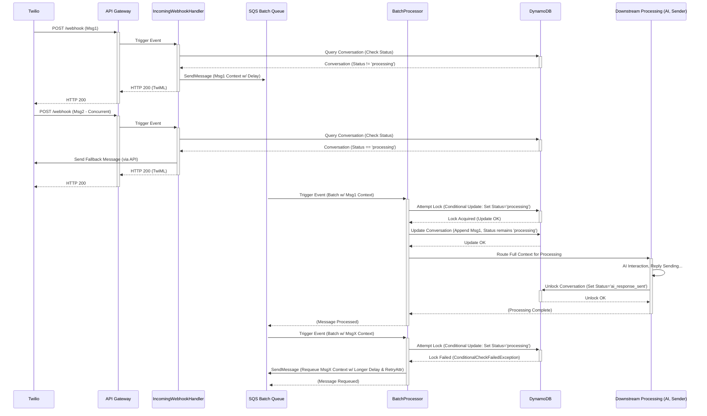

# Lambda 1 & 2 Processing Flow - Low-Level Design

This document describes the low-level design for the two lambda's deployed in the webhook processing system, encompassing the initial `webhook_handler` Lambda (Stage 1) and the subsequent `replies_processor` Lambda (Stage 2). It details the architecture for handling incoming webhooks across multiple channels and then full processing of the messages they contain.

## 1. Purpose and Responsibilities

The system employs a two-stage architecture to handle incoming messages efficiently and reliably:

1.  **webhook_handler Lambda (Stage 1):** This function acts as the central, unified entry point for all webhook requests.
    *   **Receives & Parses:** Accepts webhook POST requests from various communication channels (initially WhatsApp/SMS via Twilio) forwarded by API Gateway, then parses the raw event payload (string) into a JSON object (dictionary).
    *   **Validates:** Performs initial validation on the parsed data, and queryies the `ConversationsTable` to confirm message context and conversation state.
    *   **Routes:** Determines the appropriate next step based on validation and conversation state, queueing the message context to either a channel specific SQS queue or a human handoff SQS queue.
    *   **Acknowledges:** Returns a response (e.g., HTTP 200 with TwiML) to the webhook provider (like Twilio) to confirm receipt or error, without waiting for downstream processing.

X 2.  **BatchProcessor Lambda (Stage 2):** This function processes messages after a delay, handling batching and critical state management.
    *   **Receives:** Triggered by SQS messages from the batch queue after the configured delay.
    *   **Groups:** Aggregates messages received within the batch window for the same conversation.
    *   **Locks:** Implements a locking mechanism to ensure only one instance processes messages for a specific conversation at a time.
    *   **Updates:** Persists the batched user messages to the conversation record in DynamoDB.
    *   **Prepares:** Creates a comprehensive context object for further processing (e.g., AI interaction).
    *   **Routes:** Sends the context object to the next stage (e.g., AI processing queue). X

## 2. Concurrency Control Design

### 2.1 Key Concurrency Challenges Addressed

This design directly addresses critical concurrency scenarios:

*   **Simultaneous Messages:** Handling multiple messages from the same sender arriving very close together.
*   **Message Processing Overlap:** A new message arriving for a conversation while a previous message (or batch) for that *same conversation* is still undergoing processing (e.g., waiting for an AI response).

### 2.2 Concurrency Control Strategy

The strategy combines two key mechanisms:

X 1.  **Message Batching via SQS Delay:**
    *   Incoming messages destined for AI processing are placed onto an SQS queue configured with a `DelaySeconds` parameter (recommended: 10-20 seconds).
    *   This delay creates a "batching window," allowing messages sent in quick succession by a user to be grouped together before processing begins.

2.  **Conversation Locking via Status Flag:**
    *   Before the `BatchProcessorLambda` starts processing a batch of messages for a conversation, it attempts to "lock" the corresponding conversation record in DynamoDB.
    *   This lock is achieved by using a conditional `UpdateItem` operation to set the `conversation_status` field to `processing_reply`.
    *   The condition ensures the update only succeeds if the status is *not already* `processing_reply`.
    *   If the lock attempt fails, it means another process holds the lock, and the current batch is requeued.
    *   The lock is released (status updated, e.g., to `ai_response_sent`) only after the entire processing cycle for that batch, including sending the reply, is complete. X

## 3. Detailed Processing Flow

### 3.1 Stage 1: IncomingWebhookHandler Lambda

1.  **Reception & Parsing:**
    *   API Gateway triggers the `handler` function with an `event` dictionary.
    *   **Expected Twilio Body Parameters** (in `event['body']`, form-urlencoded):
        - `From`: Sender's phone number (e.g., `whatsapp:+1...`)
        - `To`: Recipient's number (e.g., `whatsapp:+1...`)
        - `Body`: The message text.
        - `MessageSid`: Twilio's unique message identifier (e.g., `SMxxxxxxxx`).
        - `AccountSid`: Twilio Account SID (e.g., `ACyyyyyyyy`).
    *   The `handler` calls `utils.parsing_utils.create_context_object(event)`.
    *   This function determines the `channel_type` from `event['path']`.
    *   It parses the `event['body']` based on the channel.
    *   It populates and returns a `context_object` dictionary with `snake_case` keys (or `None` on failure).
    *   **Flow Diagram:**
        ```mermaid
        graph TD
            A[API Gateway Event] --> B(handler function);
            B --> C{Call create_context_object};
            C --> D{Determine Channel from Path};
            D --> E{Parse Body based on Channel};
            E --> F{Populate context_object w/ snake_case keys};
            F --> G{Basic Key Validation};
            G -- OK --> H(Return context_object);
            G -- Fail --> I(Return None);
            H --> B;
            I --> B;
        ```
    *   **Example Resulting `context_object` (for Twilio WhatsApp):**
        ```python
        {
            'channel_type': 'whatsapp',
            'from': 'whatsapp:+14155238886',
            'to': 'whatsapp:+15005550006',
            'body': 'Hello there!',
            'message_sid': 'SMxxxxxxxxxxxxxxxxxxxxxxxxxxxxx',
            'account_sid': 'ACyyyyyyyyyyyyyyyyyyyyyyyyyyyyy'
        }
        ```

2.  **Initial Validation & Conversation Retrieval:**
    *   The `handler` checks if `context_object` is `None`. If so, signals `'PARSING_ERROR'` (Step 6).
    *   The `handler` calls `core.validation.check_conversation_exists(context_object)`.
    *   This function queries the appropriate GSI in the `ConversationsTable` using keys derived from the context (e.g., `gsi_company_whatsapp_number`, `gsi_recipient_tel`) and filters for `task_complete = 0`.
    *   **Flow Diagram:**
        ```mermaid
        graph TD
            A[handler w/ context_object] --> B(Call check_conversation_exists);
            B --> C{Get GSI Config};
            C -- Fail --> X[Return CONFIGURATION_ERROR];
            C -- OK --> D{Prepare GSI Keys (Strip Prefixes)};
            D -- Fail --> Y[Return MISSING_REQUIRED_FIELD];
            D -- OK --> E[Query DynamoDB GSI w/ Filter task_complete=0];
            E -- DB Error --> F{Transient Error?};
            F -- Yes --> Z[Return DB_TRANSIENT_ERROR];
            F -- No --> AA[Return DB_QUERY_ERROR / INTERNAL_ERROR];
            E -- Success --> G{Results Count?};
            G -- 0 --> BB[Return CONVERSATION_NOT_FOUND];
            G -- 1 --> H[Get Record];
            G -- '>1' --> I{Sort Records by created_at desc};
            I --> H;
            H --> J[Update context_object];
            J --> K[Return valid: True, data: context_object];
            
            X --> A;
            Y --> A;
            Z --> A;
            AA --> A;
            BB --> A;
            K --> A;
        ```
    *   **Outcome 1: Transient DB Error:** Returns `{'valid': False, 'error_code': 'DB_TRANSIENT_ERROR', ...}` (Step 6).
    *   **Outcome 2: Other DB/Config Error:** Returns `{'valid': False, 'error_code': 'DB_QUERY_ERROR' or 'CONFIGURATION_ERROR', ...}` (Step 6).
    *   **Outcome 3: No Active Record Found:** Returns `{'valid': False, 'error_code': 'CONVERSATION_NOT_FOUND', ...}` (Step 6).
    *   **Outcome 4: Multiple Active Records Found:** Logs warning, sorts by `created_at` descending, selects the latest.
    *   **Outcome 5: Single Active Record Found / Latest Selected:** Updates the `context_object` with all fields from the retrieved DynamoDB record and returns `{'valid': True, 'data': context_object}`. The handler proceeds to Step 3.

3.  **Conversation Rule Validation:**
    *   The `handler` calls `core.validation.validate_conversation_rules(context_object)` using the *updated* context object.
    *   This function performs the following checks sequentially:
        *   **Project Status Check:** Verifies `context_object.get('project_status') == 'active'`. If not, returns `{'valid': False, 'error_code': 'PROJECT_INACTIVE', ...}` (Step 6).
        *   **Allowed Channel Check:** Verifies `context_object.get('channel_type')` is present in the `context_object.get('allowed_channels', [])` list. If not, returns `{'valid': False, 'error_code': 'CHANNEL_NOT_ALLOWED', ...}` (Step 6).
        *   **Concurrency Lock Check:** Verifies `context_object.get('conversation_status') != 'processing_reply'`. If it *is* `'processing_reply'`, returns `{'valid': False, 'error_code': 'CONVERSATION_LOCKED', ...}` (Step 6, leading to special handling).
    *   **Flow Diagram:**
        ```mermaid
        graph TD
            A[handler w/ updated context_object] --> B(Call validate_conversation_rules);
            B --> C{project_status == 'active'?};
            C -- No --> X[Return PROJECT_INACTIVE];
            C -- Yes --> D{channel_type in allowed_channels?};
            D -- No --> Y[Return CHANNEL_NOT_ALLOWED];
            D -- Yes --> E{conversation_status != 'processing_reply'?}
            E -- No --> Z[Return CONVERSATION_LOCKED];
            E -- Yes --> F[Return valid: True, data: context_object];
            
            X --> A;
            Y --> A;
            Z --> A;
            F --> A;
        ```
    *   **Success:** If all checks pass, returns `{'valid': True, 'data': context_object}`. The handler proceeds to Step 4.

4.  **Routing Logic:**
    *   The `handler` calls `core.routing.determine_target_queue(context_object)`.
    *   This function determines the target queue URL based on the following logic:
        *   **(Commented Out):** Check `hand_off_to_human == True` -> HANDOFF_QUEUE.
        *   Check `auto_queue_reply_message == True` -> HANDOFF_QUEUE.
        *   Check if `recipient_tel/email` is in `auto_queue_reply_message_from_number/email` list -> HANDOFF_QUEUE.
        *   Otherwise -> Channel-specific queue (WHATSAPP_QUEUE, SMS_QUEUE, EMAIL_QUEUE).
        ```mermaid
        graph TD
            A[Start Routing] --> B{hand_off_to_human == True?};
            B -- Yes --> Z[HANDOFF_QUEUE];
            B -- No --> C{auto_queue_reply_message == True?};
            C -- Yes --> Z;
            C -- No --> D{Recipient in Auto-Queue List?};
            D -- Yes --> Z;
            D -- No --> E{Channel?};
            E -- WhatsApp --> F[WHATSAPP_QUEUE];
            E -- SMS --> G[SMS_QUEUE];
            E -- Email --> H[EMAIL_QUEUE];
            E -- Other --> I[Error: Unknown Channel];
        ```
    *   Returns the determined Queue URL string or `None` on failure.

5.  **Queue Message:**
    *   The `handler` checks if a valid `target_queue_url` was returned. If not, signals `'ROUTING_ERROR'` (Step 6).
    *   The `handler` calls the (placeholder) `services.sqs_service.send_message(target_queue_url, context_object)`.
    *   **Idempotency Note:** Duplicate message handling (based on `message_sid`) occurs in Stage 2 before DB write.
    *   **Outcome 1: Queueing Fails:** If `send_message` raises an exception, signals `'QUEUE_ERROR'` (Step 6).
    *   **Outcome 2: Success:** Proceeds to Step 6.

6.  **Acknowledgment / Final Response:**
    *   The `handler` determines the final HTTP response based on the outcomes of the previous steps.
    *   It uses the `_determine_final_error_response` helper function, which incorporates the `response_builder` and channel-specific logic (details in Section 4.3):
        *   **Success (Steps 1-5 complete):** Returns `200 OK` (Empty TwiML for Twilio, JSON for others).
        *   **Parsing Error (`PARSING_ERROR`):** Returns `200 OK` TwiML (Twilio) or standard 400 JSON (Other).
        *   **DB Error (`DB_TRANSIENT_ERROR`):** Raises Exception -> API GW sends 5xx -> **Twilio Retries**.
        *   **DB Error (Other `DB_...`, `CONFIGURATION_ERROR`):** Returns `200 OK` TwiML (Twilio) or standard 500 JSON (Other).
        *   **Validation Error (`CONVERSATION_NOT_FOUND`, `PROJECT_INACTIVE`, `CHANNEL_NOT_ALLOWED`):** Returns `200 OK` TwiML (Twilio) or standard 404/403 JSON (Other).
        *   **Validation Error (`CONVERSATION_LOCKED`):** Returns `200 OK` TwiML with specific `<Message>...</Message>` body (Twilio) or standard 409 JSON (Other). *(Note: LLD Step 5 describes sending this message via API, returning 200 TwiML here is an alternative implementation)*.
        *   **Routing Error (`ROUTING_ERROR`):** Returns `200 OK` TwiML (Twilio) or standard 500 JSON (Other).
        *   **Queueing Error (`QUEUE_ERROR`):** Returns `200 OK` TwiML (Twilio) or standard 500 JSON (Other). *(Assuming queue error is treated as non-transient for now)*.
        *   **Unexpected Code Error:** Returns `200 OK` TwiML (Twilio safety net) or standard 500 JSON (Other).

### 3.2 Stage 2: BatchProcessor Lambda

1.  **Reception & Grouping:**
    *   Triggered by SQS after the delay, receiving a batch of messages.
    *   Messages are grouped by `conversation_id`.

2.  **Processing Each Conversation Batch:**
    *   For each `conversation_id` group:
        *   Messages are sorted chronologically by original timestamp.
        *   A unique `batch_id` is generated and associated with these messages.

3.  **Acquire Conversation Lock:**
    *   A conditional DynamoDB `UpdateItem` attempts to set `conversation_status` to `processing_reply`.
    *   **Success:** Lock acquired. Proceed to Step 4.
    *   **Failure (Lock Held):** The batch cannot be processed now. Trigger message requeuing logic (Section 4.1).

4.  **Update Conversation Record:**
    *   With the lock held, perform a DynamoDB `UpdateItem`:
        *   Append the sorted, formatted messages from the batch to the `messages` list.
        *   Update timestamps (`last_user_message_at`, etc.) and `last_batch_id`.
        *   `conversation_status` remains `processing_reply`.

5.  **Prepare for Downstream:**
    *   Create the full `context_object` needed for AI processing.
    *   Route this context to the next queue (e.g., AI agent interaction queue).

6.  **Unlock Conversation (Post-Processing):**
    *   This step is performed by the *final* Lambda in the processing chain (e.g., the one that sends the reply via Twilio).
    *   After successfully sending the reply (or handling a sending error), it performs a final `UpdateItem`:
        *   Sets `conversation_status` to `ai_response_sent` or an appropriate error state.
        *   Records completion timestamps.

## 4. Error Handling and Edge Cases

### 4.1 Message Requeuing on Lock Contention

*   When the `BatchProcessorLambda` fails to acquire the lock (Step 3.2.3), it sends the messages *back* to the SQS batch queue they came from.
*   A longer delay (e.g., +15-30 seconds from the original delay) should be applied.
*   A `RetryAttempt` message attribute should be used to track retries and prevent infinite loops, eventually sending messages to a Dead-Letter Queue (DLQ) after a configured number of failed attempts.

### 4.2 Deadlock Prevention and Recovery

*   **Risk:** A Lambda might acquire the lock and then fail before the final unlock step.
*   **Mitigation 1 (Emergency Unlock - Partial):** Include `try...except` blocks during critical processing in Stage 2. If an error occurs *after* locking, attempt an emergency unlock by conditionally setting the status to `processing_error`. This is best-effort.
*   **Mitigation 2 (Stalled Conversation Check - Robust):** Implement a separate, scheduled Lambda (`check_and_reset_stalled_conversations`) that runs periodically (e.g., every 5 minutes).
    *   It scans DynamoDB for conversations stuck in `processing_reply` state for longer than a defined threshold (e.g., 5 minutes, longer than max expected processing time).
    *   It resets the status of stalled conversations to a distinct state like `processing_timeout` and logs a warning for investigation. This prevents permanent locks.

### 4.3 Handler Error Response Logic (Stage 1 - `webhook_handler`)

The `webhook_handler` Lambda implements specific logic to handle errors detected during parsing or validation, ensuring correct retry behavior for webhook providers like Twilio.

1.  **Internal Error Reporting:** Functions within the Lambda's modules (e.g., `core/validation.py`) detect specific errors (e.g., conversation not found, transient DB issue) and return a standard dictionary indicating failure, including an `error_code` (e.g., `CONVERSATION_NOT_FOUND`, `DB_TRANSIENT_ERROR`) and a descriptive `message`.
2.  **Response Builder Suggestion:** The main `handler` function receives this error information. It uses a utility (`utils/response_builder.py`) to translate the `error_code` into a *suggested*, standard HTTP response structure. This builder contains a mapping from internal error codes to default HTTP status codes (e.g., `CONVERSATION_NOT_FOUND` -> 404, `DB_TRANSIENT_ERROR` -> 503) and formats a standard JSON error body.
3.  **Final Response Determination (Handler Logic):** The `handler` then applies channel-specific logic:
    *   **For Twilio Channels (`whatsapp`, `sms`):**
        *   If the error code represents a **known transient error** (e.g., `DB_TRANSIENT_ERROR`, defined in `TRANSIENT_ERROR_CODES`), the handler **raises an Exception**. This causes the Lambda execution to fail, signaling API Gateway to return a 5xx response (based on Integration Response mapping), which triggers a **Twilio retry**.
        *   If the error code represents **any other non-transient error** (including parsing failures, validation errors like `CONVERSATION_NOT_FOUND`, or unexpected internal 5xx errors), the handler **returns a 200 OK response with empty TwiML**. This prevents Twilio from retrying on errors that won't resolve themselves.
        *   A final `try...except` block in the handler acts as a safety net, catching unexpected code bugs and returning 200 OK TwiML to prevent retries on these unforeseen issues.
    *   **For Other Channels (e.g., `email`):**
        *   The handler generally returns the standard error response (e.g., 4xx or 5xx JSON) suggested by the `response_builder`.

This approach ensures that only explicitly identified transient infrastructure issues trigger webhook retries from providers like Twilio, while validation failures and unexpected errors are acknowledged without causing unnecessary retries.

## 5. Concurrency Considerations and Recommendations

*   **Batch Window (SQS Delay):** 10-20 seconds is a reasonable starting point. Monitor user behavior and adjust. Shorter means faster response for single messages; longer improves batching potential for rapid-fire messages but delays the initial response.
*   **Lock Timeout Handling:** The scheduled "stalled check" Lambda is essential. Alerting on detected timeouts is recommended.
*   **Requeuing:** Define a max retry count (e.g., 2-3) and use a DLQ for persistent failures. Consider exponential backoff for retry delays.
*   **Batching Implementation:** Group by `conversation_id`, sort by timestamp, update DB once per batch. Ensure Lambda resources (memory/timeout) can handle the max SQS batch size (usually 10).
*   **Monitoring:** Track concurrent message rejections, average batch size, lock contention frequency (requeue events), lock timeouts (from scheduled check), and end-to-end processing time. Alarm on anomalies.

## 6. Future Enhancements

*   **Adaptive Batching:** Adjust SQS delay based on recent message frequency for a conversation.
*   **Alternative Locking:** Explore DynamoDB Transactions API or Step Functions for more complex state coordination if requirements evolve.
*   **Real-time Feedback:** Use WebSockets to push status updates (e.g., "Processing...", "AI is typing...") to user interfaces if applicable.

## 7. Sequence Diagram



## 8. Potential Considerations

### 8.1 Batching Implementation
1. Use standard SQS queues (not FIFO) with `conversation_id` as a message attribute.
2. Inside the BatchProcessor Lambda, group `event.Records` by `conversation_id`.
3. Sort each group of messages by original timestamp to preserve order.
4. Perform a single DynamoDB `UpdateItem` call per conversation batch to append messages and update timestamps.

### 8.2 Lock Timeout Handling
- If processing fails while `conversation_status` is `processing_reply`, records can remain locked indefinitely.
- Consider adding a TTL on the `processing_started_at` timestamp or periodic check to reset stale locks.
- Implement a scheduled Lambda (`check_and_reset_stalled_conversations`) to find and unlock conversations stuck past a threshold (e.g., 5–10 minutes).

### 8.3 Handoff Queue Logic
- Ensure the `auto_queue_reply_message` and `auto_queue_reply_message_from_number` flags are interpreted consistently across channels.
- Confirm messages flagged for human handoff are always routed to the correct SQS handoff queue.

### 8.4 Message Capacity Planning
- Anticipate more than 10 messages arriving within the SQS delay window (batch size limit).
- Plan for splitting or aggregating large batches to avoid Lambda timeouts or memory issues.
- Monitor peak message volumes and adjust Lambda memory, timeout settings, and queue configurations accordingly.

## 9. Idempotency and Deduplication
To prevent processing the same message twice (e.g., due to Lambda timeouts or Twilio retries), implement the following strategies:

1. Use the Twilio `MessageSid` as a deduplication key in each message context.
2. **Consumer-side check**: In the BatchProcessor Lambda (or in the DynamoDB update logic), verify whether `MessageSid` already exists in the conversation's `messages` list before appending:
   - Query the conversation record for existing message IDs.
   - If `MessageSid` is found, skip processing this message and log a `DuplicateMessageDetected` event.
3. **Conditional DynamoDB write**: Use a conditional update expression to append only if no existing item has the same `MessageSid`, e.g.:  
   ```python
   table.update_item(
     Key={'conversation_id': conv_id},
     UpdateExpression="SET messages = list_append(if_not_exists(messages, :empty), :new_messages)",
     ConditionExpression="attribute_not_exists(messages[?].message_id)",  # pseudo-code
     ExpressionAttributeValues={':new_messages': new_messages, ':empty': []}
   )
   ```
4. **Optional FIFO Queue**: Switch the batch SQS queue to FIFO and set `MessageDeduplicationId` to `MessageSid`. SQS will automatically drop duplicates within a 5-minute window.

These measures ensure idempotent processing even if Twilio retries the webhook or a Lambda invocation times out after enqueuing a message.

## 10. Monitoring and Logging

### 10.1 Lambda Execution Logs (INFO / ERROR)
- Log at **INFO** level for key events in both Lambdas:
  * Incoming webhook received and parsed
  * Validation outcome (success or business-rule failure)
  * Message queued to SQS or fallback sent
  * Batch processing start and completion
- Log at **ERROR** level for unexpected exceptions or downstream failures (DynamoDB, SQS errors).
- Use structured logging (JSON or key/value pairs) to simplify searching in CloudWatch Logs.
- Configure LogGroup retention (e.g., 30 days) for both functions in your SAM/CloudFormation.

### 10.2 X-Ray Tracing
- Enable **Active Tracing** on both Lambdas to correlate end-to-end traces:
  ```yaml
  IncomingWebhookHandler:
    Properties:
      TracingConfig:
        Mode: Active
  BatchProcessorLambda:
    Properties:
      TracingConfig:
        Mode: Active
  ```
- (Optional) Instrument code with the AWS X-Ray SDK to capture DynamoDB/SQS subsegments.

### 10.3 CloudWatch Metrics & Alarms
- Leverage built-in Lambda metrics:
  * **Errors**: count of function errors
  * **Duration**: execution time
  * **Throttles**: if concurrency limits are hit
  * **IteratorAge** (for BatchProcessor SQS trigger) shows message delay in the queue
- Define **Metric Filters** on Lambda logs for custom events (e.g. `DuplicateMessageDetected`, `LockContention`).
- Create **Alarms** for critical conditions:
  * Lambda Errors > 1% of invocations over 5 minutes
  * Throttles > 0
  * IteratorAge > configured SQS visibility timeout
  * High message requeue count (indicates contention or failures)

## 11. Deployment

When deploying both the IncomingWebhookHandler and BatchProcessor Lambdas, follow the same SAM CLI workflow used for the API Gateway:

### 11.1 Prerequisites
- AWS CLI configured with the target account credentials
- AWS SAM CLI installed (`sam --version`)
- Docker running (required for `--use-container` builds)
- Git branch checkout:
  - `develop` for **dev** deployments
  - `main` for **prod** deployments

### 11.2 Build (Containerized)
Run at the project root to package your Lambda code and dependencies:
```bash
sam build --use-container
```
Artifacts and the processed `template.yaml` are output to `.aws-sam/build/`.

### 11.3 Deploying with SAM CLI

#### Deploy to DEV
```bash
git checkout develop && git pull origin develop
sam deploy \
  --template-file .aws-sam/build/template.yaml \
  --stack-name replies-engine-dev \
  --capabilities CAPABILITY_IAM CAPABILITY_NAMED_IAM \
  --resolve-s3 \
  --parameter-overrides EnvironmentName=dev LogLevel=DEBUG
```

#### Deploy to PROD
```bash
git checkout main && git pull origin main
sam deploy \
  --template-file .aws-sam/build/template.yaml \
  --stack-name replies-engine-prod \
  --capabilities CAPABILITY_IAM CAPABILITY_NAMED_IAM \
  --resolve-s3 \
  --parameter-overrides EnvironmentName=prod LogLevel=INFO
```

### 11.4 Post-Deployment Manual Steps
- Populate AWS Secrets Manager with Twilio credentials under `/replies-engine/${EnvironmentName}/twilio`.
- Associate any required environment variables or config in the deployed Lambda via the SAM parameters.
- Validate that the `IncomingWebhookHandler` Lambda has the correct AWS IAM role permissions (DynamoDB, SQS, Secrets Manager, CloudWatch).
